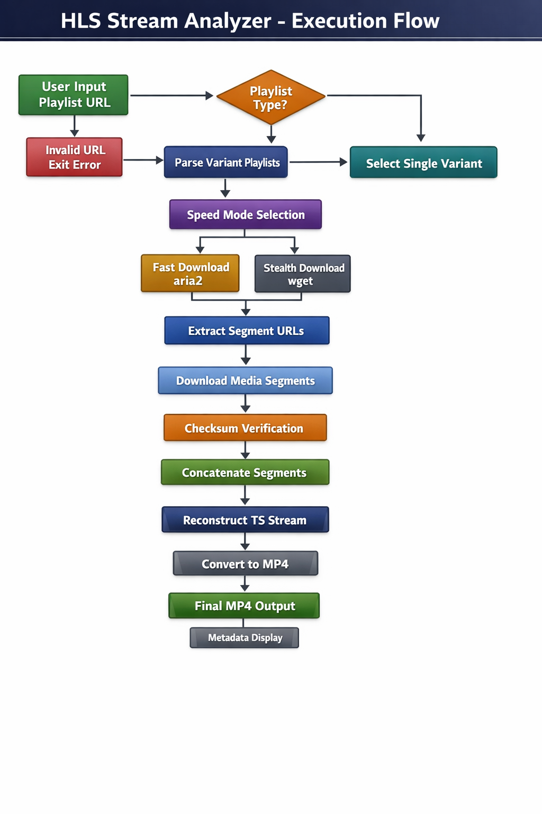

# HLS Stream Analyzer


A Bash-based tool for analyzing and reconstructing HTTP Live Streaming (HLS) media streams.

This project is designed for **security research, traffic analysis, and authorized penetration testing** of media delivery systems. It allows researchers to inspect HLS playlist structures, analyze segmentation behavior, and reconstruct streams for offline inspection.

---

## Features

- Detects **master vs variant** HLS playlists
- Supports **multiple resolutions / variants**
- Handles **relative and absolute segment URLs**
- Fast (parallel) and stealth (sequential) download modes
- Segment integrity verification (checksums)
- Offline stream reconstruction
- Clean per-variant output structure
- Minimal dependencies

---

## 📐 Architecture Overview

```html
<p align="center">
  
</p>
```
---

## 🧠 Architecture Explanation

### 1. User Input & Validation

The tool begins by prompting the user for an HLS playlist URL (`.m3u8`).
A basic validation check ensures the URL uses a valid HTTP or HTTPS scheme. Invalid input results in an immediate exit to prevent unintended behavior.

---

### 2. Initial Playlist Retrieval

The provided playlist is downloaded and stored locally.
This initial playlist serves as the entry point for analysis and determines whether the stream is a **master playlist** or a **variant playlist**.

---

### 3. Playlist Type Detection

The analyzer inspects the playlist for `EXT-X-STREAM-INF` tags:

* **Master playlist detected**

  * All available variant playlists (bitrates/resolutions) are extracted.
  * The user may select a single variant or process all available variants.

* **Variant playlist detected**

  * The tool proceeds directly with that single stream.

This branching ensures flexibility when handling real-world HLS configurations.

---

### 4. Download Mode Selection

Before segment retrieval, the user selects a download strategy:

* **Fast Mode (aria2)**
  Parallel downloads for lab environments or controlled testing.

* **Stealth Mode (wget)**
  Sequential downloads with reduced request footprint, suitable for cautious or sensitive testing scenarios.

The selected mode applies consistently across all chosen variants.

---

### 5. Segment Extraction & Normalization

For each variant playlist:

* Media segment references (`.ts`, `.mp4`, `.m4s`) are extracted.
* Relative URLs are normalized into absolute URLs using the playlist base path.
* A consolidated segment list is generated for controlled downloading.

---

### 6. Media Segment Download

Segments are downloaded using the chosen method and stored in a dedicated per-variant directory.
This isolation prevents cross-variant contamination and supports parallel analysis.

---

### 7. Integrity Verification

All downloaded media segments are hashed using MD5 checksums.
This step allows researchers to verify segment integrity, identify corruption, and document inconsistencies during assessments.

---

### 8. Stream Reconstruction

Downloaded segments are concatenated in order to reconstruct the full transport stream (`.ts`).
No decryption or DRM bypassing is performed at any stage.

---

### 9. Remuxing & Metadata Extraction

The reconstructed transport stream is remuxed into an MP4 container using `ffmpeg` without re-encoding.
Basic stream metadata (duration, codecs, stream layout) is displayed for verification and documentation.

---

### 10. Final Output

Each processed variant produces:

* Original variant playlist
* Segment URL list
* Checksum file
* Reconstructed transport stream
* Final MP4 output

All artifacts are stored in a clean, per-variant directory structure for offline inspection and reporting.

---


## Why This Tool Exists

HLS streams are frequently misconfigured in real-world environments. During security assessments, testers may encounter:

- Publicly accessible playlists
- Missing authentication or authorization
- Token leakage in playlist URLs
- Improper CDN access controls
- Missing or misconfigured encryption (`EXT-X-KEY`)

This tool assists in **analyzing HLS implementations**, validating protections, and documenting security findings in authorized testing scenarios.

---

## Requirements

- bash (>= 4.x)
- wget
- ffmpeg
- aria2 *(optional — required for fast mode)*

---

## Installation

```bash
git clone https://github.com/404saint/hls-stream-analyzer.git
cd hls-stream-analyzer
chmod +x hls-analyzer.sh
````

---

## Usage

### Basic Execution

```bash
./hls-analyzer.sh
```

The tool runs in **interactive mode** and will guide you through the analysis process.

---

### Step 1: Provide HLS Playlist URL

You will be prompted to enter an HLS playlist URL (`.m3u8`):

```
Enter playlist (.m3u8) URL:
```

Supported inputs:

* Master playlists
* Variant playlists
* Absolute or relative URLs

---

### Step 2: Variant Selection (Master Playlists)

If a **master playlist** is detected, available variants (resolutions/bitrates) are listed:

```
Available variants:
1) low/playlist.m3u8
2) mid/playlist.m3u8
3) high/playlist.m3u8
```

You may select:

* A **single variant** by number
* **All variants** by typing `all`

If a variant playlist is provided directly, this step is skipped.

---

### Step 3: Download Mode Selection

Choose the desired download behavior:

```
1) Fast (parallel, aria2)
2) Stealth (sequential, wget)
```

#### Fast Mode

* Uses `aria2`
* Parallel segment downloads
* Suitable for lab environments and controlled testing

#### Stealth Mode

* Uses `wget`
* Sequential downloads
* Reduced request footprint
* Better suited for cautious testing scenarios

---

### Step 4: Processing & Reconstruction

For each selected variant, the tool performs the following:

1. Downloads the variant playlist
2. Extracts and normalizes segment URLs
3. Downloads media segments
4. Generates integrity checksums
5. Reconstructs the media stream
6. Converts the output to MP4
7. Displays stream metadata

Progress and status messages are shown during execution.

---

## Output Structure

Each variant is processed in its own directory:

```
hls_output/
└── variant_name/
    ├── variant.m3u8
    ├── segments.txt
    ├── checksums.md5
    ├── full_video.ts
    └── output.mp4
```

This structure prevents data overlap and supports multi-variant analysis.

---

## Security Considerations

* This tool **does not bypass DRM**
* Encrypted streams (`EXT-X-KEY`) are **not decrypted**
* No exploit payloads or obfuscation mechanisms are included
* Intended strictly for **authorized security testing**

---

## Disclaimer

This project is intended for **educational purposes and authorized security testing only**.

Do **NOT** use this tool against systems you do not own or do not have explicit permission to test.
The author assumes no responsibility for misuse.

---

## Author

**RUGERO Tesla**

Ethical Hacker & Freelance Penetration Tester

